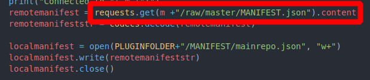
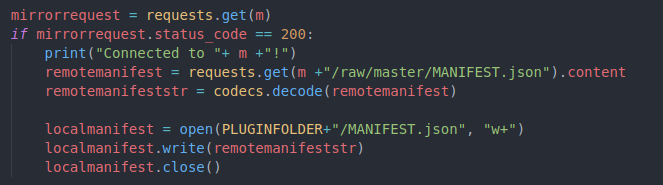

# PlugM, PyZ's plugin manager's main repo

- - -

## Table of Contents
- [PlugM, PyZ's plugin manager's main repo](#plugm-pyzs-plugin-managers-main-repo)
  - [Table of Contents](#table-of-contents)
- [How does it work?](#how-does-it-work)
  - [For end users](#for-end-users)
    - [First-time use](#first-time-use)
  - [Commands:](#commands)
  - [For plugin developers/repo maintainers](#for-plugin-developersrepo-maintainers)
    - [Submitting a plugin](#submitting-a-plugin)
      - [Policies](#policies)
      - [File structure](#file-structure)
      - [Archiving and check summing your plugin](#archiving-and-check-summing-your-plugin)
      - [Uploading and final submission of your plugin](#uploading-and-final-submission-of-your-plugin)
    - [Creating a repository](#creating-a-repository)
      - [WARNING](#warning)
    - [Updating](#updating)

# How does it work?

## For end users
PlugM, the plugin manager used for these plugins works similarly to Linux package managers.

### First-time use
After you install PyZ, if you want to start using PlugM, you must first intialize it using `pyz plugm init`. This is only done once and creates some folders and a local repo list and manifest.json.

## Commands:

- `init` - Initializes PlugM - ONLY RUN THIS ONCE
- `update` - Updates the list of available plugins
- `upgrade` - Updates any packages that have available updates.
- `search` - Searches for a plugin
- `install` - Installs a plugin.
- `remove` - Removes a plugin.

## For plugin developers/repo maintainers

### Submitting a plugin

Before we continue, you have some policies to follow when creating a PyZ package

#### Policies

- You must upload to a reputable file sharing service, e.g. NextCloud, Google Drive, Dropbox or One Drive
- In your upload, you must include a text file with a sha256sum check summing your zip file
- If your plugin has any external python modules as dependencies that aren't imported in the shell itself, let me know in some sort of file in your upload

#### File structure 

Anywho, the basic file structure for a plugin should look like a normal python module, for example:

```
qolcommands
├── clear.py
├── __init__.py
├── listdir.py
└── pythonversion.py
```

You have your \_\_init__.py which imports all the other python files, so that it can be imported as a python module.

#### Archiving and check summing your plugin

PyZ plugins are stored in zip files for ease-of-use and os-agnostic compatibility. To zip your plugins, use whatever GUI program you have, or 

```bash
zip -r your-plugin.zip your-plugin/
```

For PyZ plugins, use sha256 for checksumming. To do this, use

- on Windows: `Get-FileHash your-plugin.zip -Algorithm SHA256`
- on macOS/Linux: `sha256sum your-plugin.zip`

#### Uploading and final submission of your plugin

First upload the plugin to your favorite file sharing service and head to this repository. Then click on the issues tab, submit a new "issue", choose the "plugin submission" label, say a few words implying that you want to submit a package and paste a link to the zip!


### Creating a repository

#### WARNING

PlugM currently only supports its single repository. Support will be added later! It also currently only supports repositories hosted on GitHub. This is due to the way, downloading the `MANIFEST.json` is implemented.



PlugM is going to eventually support basically anything that can store files and have files be downloaded from via HTTPS.

In every repository, you must store a `MANIFEST.json` file that looks like this.

```json
{
    "plugins": [
        {
            "name": "sample-package",
            "version": "1.0",
            "description": "This is a sample plugin!",
            "file": "sample-package.zip"
        },

        {
            "name": "another-package",
            "version": "1.0",
            "description": "Hey I'm also a plugin!",
            "file": "another-package.zip"
        }
    ]
}
```

Obviously, you can remove the two sample plugins, but every plugin must include:

- Its name
- Its version
- Its description
- Its archive's file name

### Updating

The way PlugM updating works is when you update it for the first time, it downloads the MANIFEST.json from this repository



and writes it to its own MANIFEST.json, stored on the end-user's computer. This, however, overwrites the whole JSON.

